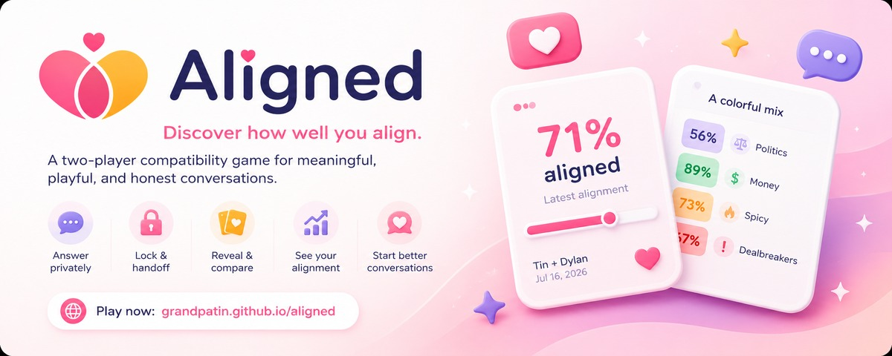
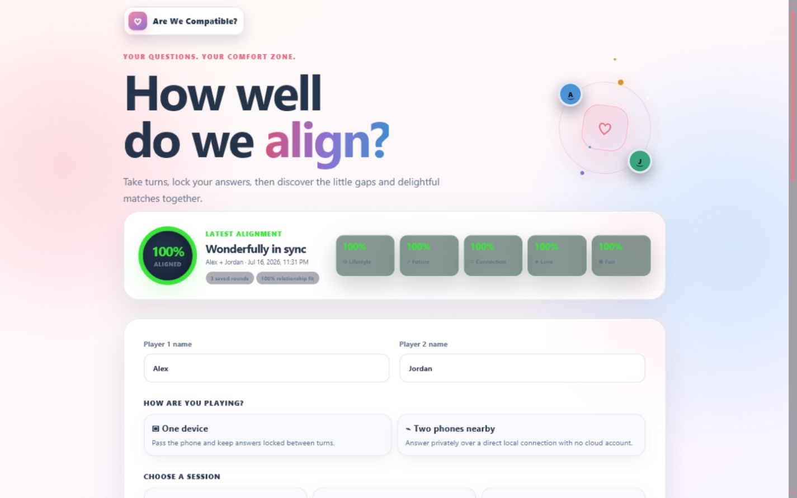
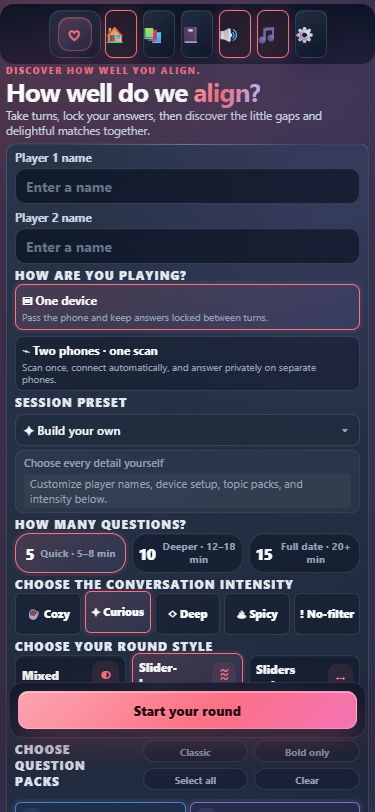

# Aligned

**Discover how well you align.**

Aligned is a two-player compatibility game for meaningful, playful, and honest conversations. Each person answers the same questions privately, then reveals the results through playful 3D cards, alignment scores, category heat colors, and conversation prompts.

**Live game:** [grandpatin.github.io/aligned](https://grandpatin.github.io/aligned/)

**Repository:** [github.com/GrandpaTin/aligned](https://github.com/GrandpaTin/aligned)



## Gameplay

1. Enter two player names and choose a session, length, intensity, round style, and question packs.
2. Answer privately on one shared device or two nearby phones connected from a single QR scan.
3. Lock the first person’s answers before handing over a shared device.
4. Answer the exact same questions in the same order.
5. Reveal each card together and compare answers, comments, alignment, and conversation prompts.
6. Return later to review saved rounds and each person’s answer history.

## Features

- One-device pass-and-play with a private handoff lock screen
- Automatic one-scan two-phone play with short-lived signaling and encrypted WebRTC transport
- 309 built-in questions across Connection, Lifestyle, Future, Love, Fun, Spicy, Money, Politics, and Dealbreakers
- Mixed, slider-heavy, and sliders-only rounds with 5, 10, or 15 questions
- Cozy, Curious, Deep, Spicy, and No-filter conversation intensities
- Unanswered-first selection, least-recently-seen reuse, exclusions, favorites, custom questions, and custom packs
- Per-question comments, importance ratings, private notes, conversation follow-through, and answer history
- Overall and topic alignment, relationship-fit scoring, match celebrations, and difference heat colors
- Local persistence, readable JSON backup import/export, optional AES-GCM encrypted backups, and a device-local privacy PIN
- Four visual themes, three sound themes, reduced motion, high contrast, and adjustable text size
- Installable PWA behavior and offline app-shell support

## Conversation intensities

- **Cozy:** warm, playful, low-pressure questions
- **Curious:** balanced and meaningful conversation
- **Deep:** vulnerable and reflective prompts
- **Spicy:** flirty and more intimate questions
- **No-filter:** bold topics and potential dealbreakers

Sensitive question packs such as Spicy, Politics, Money, and Dealbreakers remain opt-in.

## Local data and backups

Game state is stored in the current browser profile. The rebrand includes a one-time, non-destructive migration from the previous browser-storage key to `aligned-state-v1`; existing names, preferences, question history, rounds, and in-progress games are preserved. The legacy key is not overwritten.

New readable exports use `aligned-backup-YYYY-MM-DD.json`. New encrypted exports use `aligned-private-YYYY-MM-DD.aligned`. Valid backups created before the rebrand—including legacy `.awc` encrypted files—remain importable.

## Local development

No build step is required. Node.js 18 or newer is recommended for the included development server and checks.

```bash
npm start
```

Open `http://127.0.0.1:4173`. For another phone on the same local network:

```bash
node scripts/serve.mjs --host 0.0.0.0
```

Then open `http://YOUR-COMPUTER-IP:4173` on the phone. A firewall permission prompt may appear.

## Quality checks

```bash
npm test
```

The checks cover JavaScript syntax, the question catalog, slider labels, unique IDs, QR generation, storage and import compatibility, signaling-room security, PWA assets, GitHub Pages-safe paths, accessibility invariants, and common secret formats.

## Deployment

Aligned is a zero-build static application deployed through GitHub Pages:

- Source: `main` branch
- Folder: repository root (`/`)
- Entry point: `index.html`

All deployable paths are relative so the app works beneath the `/aligned/` repository path. `.nojekyll` keeps static delivery predictable. The companion Cloudflare Worker in [`worker/`](worker/) provides short-lived WebRTC signaling; its existing infrastructure identifier is intentionally retained so configured relay credentials and installed clients continue working.

## Browser support

Current stable Chrome, Edge, Firefox, and Safari releases are supported. Two-phone mode prefers a direct WebRTC connection and can use a configured TURN relay on restrictive networks. Pass-and-play remains available when WebRTC is unavailable.

## Project structure

- `index.html` — application markup, styles, question catalog, and game logic
- `manifest.webmanifest` — installable PWA metadata
- `sw.js` — network-first offline app-shell cache
- `scripts/serve.mjs` — dependency-free local web server
- `tests/` — production and signaling regression checks
- `worker/` — one-scan signaling service
- `docs/` — current desktop and mobile screenshots

## Screenshots

| Desktop | Mobile |
| --- | --- |
|  |  |

## Privacy

Aligned has no accounts, analytics, advertising SDKs, or cloud answer storage. Game data remains in the local browser unless a player exports a backup or sends answers to their partner over the encrypted WebRTC data channel. The connection service handles expiring connection metadata and does not receive answers as application data. See [SECURITY.md](SECURITY.md) for practical limitations.

## Future improvements

- Optional multilingual question packs
- Broader relationship and friendship wording modes
- Expanded automated cross-browser and accessibility coverage
- More locally stored post-round intentions and reflection tools
- Optional installable iOS and Android wrappers using the same local-first core

## License

Released under the [MIT License](LICENSE).
